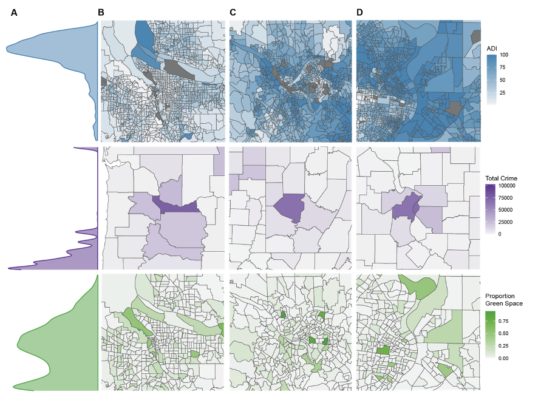

# A Bayesian Causal Forests Approach to Characterizing Associations between Callous-Unemotional Traits and Externalizing Problems #
*. Callous-unemotional (CU) traits are correlated with high risk for externalizing disorders. However, because CU traits and externalizing disorders share many etiological factors, it is not known whether CU traits truly confer unique risk or are simply a marker of disorder severity. Given the nature of the question, a true experimental design with random assignment is not possible. Thus, this study adopted a novel Bayesian Causal Forests approach to test the semi-causal effect of CU traits on symptoms of conduct, oppositional defiant, and attention deficit hyperactivity disorder, and examined whether neighborhood factors moderated these effects. *

## Project Lead
Kristin A. Murtha

## Senior Authors 
Rebecca Waller

## Collaborators 
Abigail Bordeianu, Samantha Perlstein, Jakob Seidlitz, Adrian Raine, Samue Hawes, Amy L. Byrd

## Project Start Date 

## Datasets 
ABCD Release 5.0

## Conference Presentations 
- A Bayesian Causal Forests Approach to Characterize Risk Pathways between CU Traits and Externalizing Problems. Symposium presentation at the American Academy of Child and Adolescent Psychiatry Annual Meeting, October 2025. 

# Code Documentation 
*All analysis was completed in R, utilizing [bcf](https://cran.r-project.org/web/packages/bcf/index.html) package.*

## BCF Models
1. Use [Step01_Run_BCF_Models.Rmd](https://github.com/krmurtha1/BCF_externalizing/blob/main/Step01_Run_BCF_Models.Rmd) to run main and sensitivity analyses. 

2. Use [Step02_Plot_Models.Rmd](https://github.com/krmurtha1/BCF_externalizing/blob/main/Step02_Plot_Models.Rmd) to plot main results. 
> This script generates figures 2-5 and figure S1.  

3. Use [Step03_Plot_Sensitivity_Models.Rmd](https://github.com/krmurtha1/BCF_externalizing/blob/main/Step03_Plot_Sensitivity_Models.Rmd) to plot supplementary results. 
> This script generates figures S2-S5. 

4. Use [Step04_Make_Map_Figures.Rmd](https://github.com/krmurtha1/BCF_externalizing/blob/main/Step04_Make_Map_Figures.Rmd) to plot supplementary results. 
> This script generates figure 1. 
